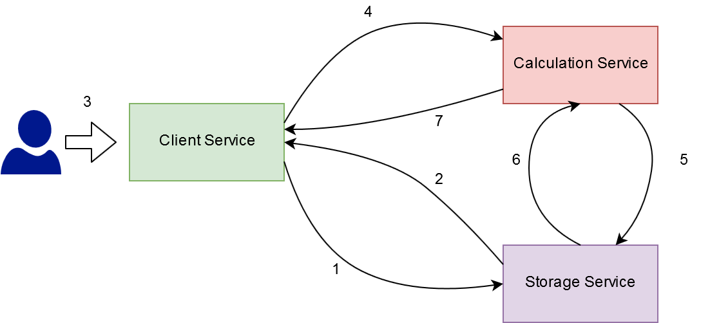
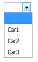

# Fuel Consumption Calculation

A simple fuel consumption calculation application.
This applications is composed of three micro-service.

The communication flow is as follow:

1. **Client Service** calls **Storage Service** to get the list of vehicles
2. The list of vehicles names is given back to **Client Service**
3. **Client Service** displays the list of vehicle names in a drop-down
4. **Client Service** sends the vehicle name along with the Km to the **Calculation Service**
5. **Calculation Service** calls **Storage Service** to retrieve the gasoline consumption per Km to the given car
6. The information of how many gasoline liters per Km is consumed is given back
7. **Calculation Service** performs the calculation and the final result is returned to the **Client Service** which displays it

## Example of data exchanged

**1)** GET /cars

**2)** `{
 "Car1", "Car2", "Car3"
}`

**3)**

**4)** POST
`{
 "car" : "Car1", "km": "250"
}`

**5)** GET /cars/car1

**6)** `{
 "gas_per_km": "1.7"
}`

**7)** `{
 "consumption": "425"
}`